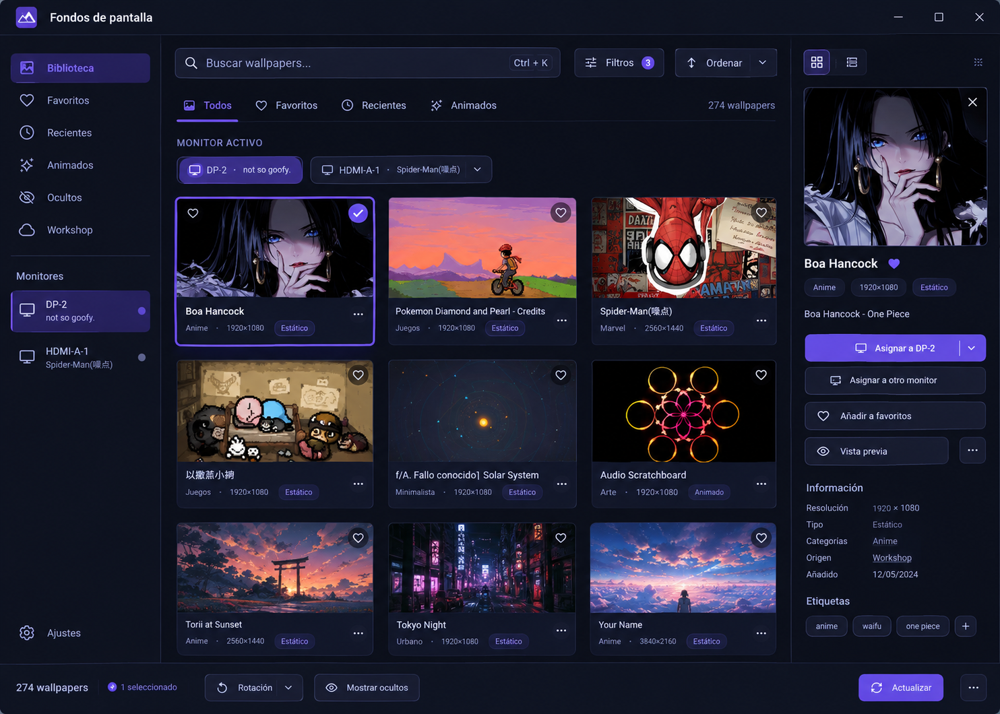

# Propuesta de rediseño visual (pendiente de implementar)

Notas de referencia para un futuro rediseño de la interfaz: mas densidad en la
cuadricula de wallpapers, buscador mas protagonista, filtros en un desplegable,
favoritos, vista previa grande, menu contextual, etc. Ver la captura de la
interfaz en el momento en que se escribio esto.

---

Sí. Viendo la captura, la interfaz **ya es funcional y bastante limpia**, pero tiene un problema principal: parece más una colección de controles colocados en paneles que una aplicación con una **jerarquía visual clara**. Hay mucho espacio vacío, demasiados elementos con el mismo peso visual y la zona de wallpapers podría aprovechar muchísimo mejor el espacio.

Yo la rediseñaría manteniendo el estilo oscuro/púrpura actual, pero acercándola a una mezcla de **Steam + GNOME/KDE moderno + biblioteca multimedia**.

---

# 1. Problemas principales que veo

### 1.1. La jerarquía visual es débil

Ahora mismo tienes:

```text
Buscar y filtrar
[ búsqueda ] [ etiquetas ] [ clasificación ] [ ordenar ] [ ocultos ]

Asignación por monitor
○ DP-2    ○ HDMI-A-1

┌─────────────────────────────────────────┐
│                                         │
│    wallpaper       wallpaper             │
│                                         │
│    wallpaper       wallpaper             │
│                                         │
│    wallpaper       wallpaper             │
│                                         │
└─────────────────────────────────────────┘

274 wallpapers [ botones................]
```

Prácticamente todo está dentro de cajas con bordes.

Esto provoca que el usuario perciba:

> "Tengo muchos paneles"

en vez de:

> "Estoy explorando mi biblioteca de wallpapers."

Yo reduciría muchísimo el número de contenedores visibles.

---

# 2. Haría que la biblioteca fuese el protagonista

La parte más importante de la aplicación debería ser **la colección de wallpapers**, no los filtros.

Actualmente las miniaturas son relativamente pequeñas y están separadas por muchísimo espacio.

Yo utilizaría una cuadrícula más densa:

```text
┌───────────────────────────────────────────────────────────┐
│ 🔍 Buscar wallpapers...                         ⚙          │
├───────────────────────────────────────────────────────────┤
│ Todos  Favoritos  Recientes  Animados  Estáticos          │
│                                                           │
│  ┌──────────┐ ┌──────────┐ ┌──────────┐ ┌──────────┐     │
│  │          │ │          │ │          │ │          │     │
│  │  IMAGE   │ │  IMAGE   │ │  IMAGE   │ │  IMAGE   │     │
│  │          │ │          │ │          │ │          │     │
│  └──────────┘ └──────────┘ └──────────┘ └──────────┘     │
│   Boa        Pokemon       Spider-Man   Kirby             │
│                                                           │
│  ┌──────────┐ ┌──────────┐ ┌──────────┐ ┌──────────┐     │
│  │          │ │          │ │          │ │          │     │
│  │  IMAGE   │ │  IMAGE   │ │  IMAGE   │ │  IMAGE   │     │
│  └──────────┘ └──────────┘ └──────────┘ └──────────┘     │
└───────────────────────────────────────────────────────────┘
```

En una pantalla de **1132×809**, yo intentaría mostrar **4 columnas**, incluso 5 si el tamaño mínimo de las tarjetas lo permite.

---

# 3. El buscador debería ser mucho más importante

Actualmente el buscador mide aproximadamente 330 px y comparte protagonismo con muchos botones.

Lo convertiría en una barra de búsqueda grande:

```text
┌──────────────────────────────────────────────────────────────┐
│ 🔍  Buscar wallpapers...                          Ctrl + K    │
└──────────────────────────────────────────────────────────────┘
```

Unos **400–600 px de ancho** dependiendo de la ventana.

Y debajo:

```text
Todos     Favoritos     Recientes     Animados     Estáticos
```

Así el usuario entiende inmediatamente:

> Aquí estoy buscando contenido.

---

# 4. Los filtros deberían convertirse en un botón

Ahora tienes:

* Etiquetas
* Clasificación
* Ordenar
* Mostrar ocultos

Todos simultáneamente visibles.

Eso ocupa mucho espacio.

Haría:

```text
[ 🔍 Buscar wallpapers... ]  [Filtros 3]  [Ordenar ▾]
```

Al pulsar `Filtros`:

```text
┌─────────────────────────────┐
│ Filtros                     │
│                             │
│ Etiquetas                   │
│ ☑ Anime                     │
│ ☐ Juegos                    │
│ ☐ Minimalista               │
│ ☐ Naturaleza                │
│                             │
│ Clasificación               │
│ ○ Everyone                  │
│ ○ Mature                    │
│ ○ Adult                     │
│                             │
│ ☑ Mostrar ocultos            │
│                             │
│ [ Limpiar ]    [ Aplicar ]  │
└─────────────────────────────┘
```

Esto hace la interfaz mucho más limpia.

---

# 5. "Asignación por monitor" necesita un rediseño importante

Esta sección:

> Asignación por monitor
> ○ DP-2 (not so goofy.) ○ HDMI-A-1 (Spider-Man(噪点))

es útil, pero visualmente parece un formulario antiguo.

Yo lo convertiría en un **selector de monitores visual**.

Por ejemplo:

```text
MONITORES

┌─────────────────┐   ┌─────────────────┐
│                 │   │                 │
│     DP-2        │   │    HDMI-A-1     │
│                 │   │                 │
│  not so goofy   │   │    Spider-Man   │
│                 │   │                 │
└─────────────────┘   └─────────────────┘
       ●                       ○
```

O incluso mejor:

```text
MONITOR ACTIVO

[ 🖥 DP-2                         ▾ ]

Wallpaper actual:
┌──────────────────────────────┐
│                              │
│          PREVIEW             │
│                              │
└──────────────────────────────┘

not so goofy
```

Así queda clarísimo **a qué monitor estás asignando el wallpaper**.

---

# 6. Las tarjetas de wallpaper necesitan más información

Ahora tienes:

```text
[imagen]

boa hancock
```

Eso es demasiado básico.

Yo añadiría un overlay al pasar el ratón:

```text
┌─────────────────────────┐
│                         │
│                         │
│          IMAGE          │
│                         │
│                    ♡    │
│                 ▶      │
└─────────────────────────┘
Boa Hancock
Anime Wallpaper
```

Y en hover:

```text
┌─────────────────────────┐
│                         │
│       IMAGEN            │
│                         │
│              ♡  ⋮       │
│                         │
│      [Asignar]          │
└─────────────────────────┘
Boa Hancock
1920 × 1080 · Estático
```

---

# 7. Añadiría un botón de favorito

Esto me parece especialmente importante.

Cada wallpaper debería tener:

**♡**

en la esquina superior derecha.

Cuando esté marcado:

**♥**

Y entonces puedes tener:

```text
Todos    ♥ Favoritos    Recientes
```

Con cientos de wallpapers, esto se vuelve extremadamente útil.

---

# 8. La acción "Asignar" debería estar en cada tarjeta

Ahora el usuario:

1. selecciona monitor
2. selecciona wallpaper
3. baja abajo
4. pulsa "Asignar a esta pantalla"

Son demasiados pasos.

Podrías permitir:

### Opción A — botón en hover

```text
┌─────────────────────┐
│                     │
│      WALLPAPER      │
│                     │
│                     │
│    [ Asignar ]      │
└─────────────────────┘
```

### Opción B — doble clic

**Doble clic → asignar al monitor seleccionado.**

Y mantener el botón inferior como acción secundaria.

Esto haría la aplicación mucho más rápida.

---

# 9. El botón principal inferior es demasiado grande

Actualmente:

> ✓ Asignar a esta pantalla

es un botón enorme y morado.

El problema es que visualmente compite demasiado con el contenido.

Yo lo convertiría en una **barra de acciones contextual**.

Si no hay wallpaper seleccionado:

```text
274 wallpapers
```

Si seleccionas uno:

```text
Wallpaper seleccionado: Boa Hancock

[ ♡ Favorito ] [ 👁 Vista previa ] [ ✓ Asignar ]
```

El botón `Asignar` sí puede ser púrpura porque es la acción principal.

---

# 10. Rediseñaría completamente el footer

Actualmente:

```text
274 wallpapers
[Desuscribirse]
[Rotacion...]
[Ocultar/Mostrar]
[Asignar...]
[Refrescar lista]
[Buscar en Workshop]
```

Hay **demasiadas acciones juntas**.

Además, "Desuscribirse" es una acción potencialmente destructiva y tiene demasiado protagonismo.

Lo organizaría así:

```text
274 wallpapers                         🔄 Actualizar

────────────────────────────────────────────────────────────

                           [ ✓ Asignar ]
```

Y el resto:

```text
⋮ Más acciones
```

con:

```text
Más acciones
──────────────
Rotación automática
Ocultar wallpaper
Mostrar wallpapers ocultos
Desuscribirse
Buscar en Workshop
```

Mucho más limpio.

---

# 11. "Rotación..." debería ser mucho más explícito

El botón actual:

> ↻ Rotacion...

es ambiguo.

Lo cambiaría por:

```text
↻ Rotación
```

Al pulsarlo:

```text
Rotación de wallpapers

○ Desactivada

○ Cada 15 minutos
○ Cada 30 minutos
● Cada hora
○ Cada día

☑ Usar favoritos
☑ Evitar repetir wallpapers

              [Cancelar] [Guardar]
```

---

# 12. Los wallpapers deberían tener una previsualización grande

Esto sería una mejora enorme.

Al hacer clic:

```text
┌─────────────────────────────────────────────────────────────┐
│                                                             │
│                       WALLPAPER                             │
│                                                             │
│                                                             │
│                                                             │
│                                                             │
│                                                             │
└─────────────────────────────────────────────────────────────┘

Boa Hancock

1920 × 1080
Estático
Anime
Workshop

♥ Favorito

[ Asignar a DP-2 ]     [ ⋮ ]
```

Podría aparecer como modal.

Esto evitaría tener que intentar distinguir wallpapers pequeños.

---

# 13. El layout debería aprovechar mucho más el ancho

En tu captura hay una enorme cantidad de espacio horizontal desperdiciado.

Tienes dos columnas:

```text
        IMAGE                 IMAGE
```

Cuando perfectamente cabrían:

```text
IMAGE    IMAGE    IMAGE    IMAGE
```

Por ejemplo:

```text
┌─────────┐ ┌─────────┐ ┌─────────┐ ┌─────────┐
│         │ │         │ │         │ │         │
│         │ │         │ │         │ │         │
│         │ │         │ │         │ │         │
└─────────┘ └─────────┘ └─────────┘ └─────────┘
```

Esto además permitiría visualizar muchos más wallpapers simultáneamente.

---

# 14. Cambiaría el ratio de las tarjetas

Las imágenes actuales están dentro de una especie de formato pequeño con grandes márgenes negros.

Yo utilizaría:

**16:9**

como ratio principal.

Por ejemplo:

```text
┌──────────────────────┐
│                      │
│                      │
│       WALLPAPER      │
│                      │
│                      │
└──────────────────────┘
```

Y para wallpapers verticales:

```text
┌──────────────────────┐
│   ███        ███     │
│   ███ IMAGE  ███     │
│   ███        ███     │
└──────────────────────┘
```

con `object-fit: contain`, para no deformarlos.

---

# 15. Mejoraría muchísimo el sistema de selección

Actualmente parece que el monitor seleccionado es un radio button.

En lugar de:

```text
○ DP-2
○ HDMI-A-1
```

usaría chips:

```text
Monitor:

[ ● DP-2 ]    [ ○ HDMI-A-1 ]
```

El activo tendría:

* fondo púrpura
* borde púrpura
* texto blanco

El inactivo:

* fondo transparente
* borde gris

Mucho más moderno.

---

# 16. Utilizaría un único color de acento

El púrpura que tienes funciona bastante bien.

Mantendría:

```text
#8B7CFF
```

o una variante similar.

Pero actualmente hay varios tonos de gris/púrpura que hacen que la interfaz parezca un poco inconsistente.

Usaría aproximadamente:

```text
Background        #18181F
Surface           #20212A
Surface hover     #272834
Border            #343542

Text               #F2F2F5
Text secondary     #A5A5B0

Accent             púrpura
Accent hover       púrpura claro
```

La idea:

**gris oscuro + púrpura como único color fuerte.**

---

# 17. Los bordes deberían ser más sutiles

Ahora mismo hay bastantes cajas con:

```text
┌─────────────────────────────┐
│                             │
└─────────────────────────────┘
```

y bordes visibles.

Yo usaría más separación mediante **espaciado** y menos mediante bordes.

Por ejemplo:

### Actual

```text
┌──────────────────────────┐
│ Buscar y filtrar         │
│ ┌───────┐ ┌───────┐      │
│ └───────┘ └───────┘      │
└──────────────────────────┘
```

### Mejor

```text
Buscar y filtrar

┌───────────────────────────────────────┐
│ 🔍 Buscar...                          │
└───────────────────────────────────────┘

Todos   Favoritos   Recientes
```

Mucho más ligero.

---

# 18. Añadiría un estado de selección muy claro

Cuando seleccionas una imagen:

```text
┌─────────────────────────┐
│                         │
│                         │
│         IMAGE           │
│                         │
│                    ✓    │
└─────────────────────────┘
```

Con:

* borde púrpura
* pequeña marca ✓
* fondo ligeramente iluminado

Así se entiende inmediatamente qué wallpaper está seleccionado.

---

# 19. Añadiría un menú contextual

Click derecho sobre un wallpaper:

```text
Boa Hancock
────────────────────
✓ Asignar a DP-2
Asignar a HDMI-A-1
────────────────────
♡ Añadir a favoritos
👁 Vista previa
────────────────────
↻ Añadir a rotación
🙈 Ocultar
────────────────────
⋮ Más información
```

Esto permitiría mantener la interfaz principal mucho más limpia.

---

# 20. El título de la ventana también podría mejorar

Actualmente:

> Elegir Fondo de Pantalla

Yo pondría:

### **Fondos de pantalla**

Es más corto y natural.

Y opcionalmente:

```text
Fondos de pantalla                         ×
```

Si realmente es un selector interno de la aplicación, incluso:

```text
Wallpapers
```

podría funcionar si el resto de la aplicación utiliza terminología inglesa.

---

# 21. Mejoraría los nombres

Actualmente tienes cosas como:

> `boa hancock`

> `Pokemon Diamond and Pearl - Credits`

> `Spider-Man(噪点)`

Los títulos pueden estar bien, pero visualmente haría:

```text
Boa Hancock
```

en vez de todo minúsculas.

Y metadatos secundarios:

```text
Boa Hancock
Anime · 1920×1080
```

---

# 22. Añadiría información de cantidad y resultados

Arriba o debajo de la búsqueda:

```text
274 wallpapers
```

y cuando busques:

```text
12 resultados para "spider"
```

Por ejemplo:

```text
Buscar wallpapers...

12 wallpapers encontrados
```

Esto hace que el buscador se sienta mucho más profesional.

---

# 23. Añadiría diferentes modos de visualización

Esto sería muy interesante:

```text
▦  ⊞
```

Por ejemplo:

### Grid

```text
[██] [██] [██] [██]
[██] [██] [██] [██]
```

### Compacto

```text
[██] [██] [██] [██] [██]
```

### Lista

```text
[IMG] Boa Hancock             1920×1080
[IMG] Spider-Man              2560×1440
[IMG] Pokemon                 1920×1080
```

El modo grid sería el predeterminado.

---

# 24. Añadiría soporte para favoritos y recientes

La navegación superior podría quedar:

```text
Todos     Favoritos     Recientes     Ocultos
```

Y quizás:

```text
Workshop
```

como categoría independiente.

Esto es mucho más intuitivo que tener "Mostrar ocultos" mezclado con filtros.

---

# 25. La interfaz que yo haría

Visualmente, me imagino algo así:

```text
┌──────────────────────────────────────────────────────────────┐
│ Fondos de pantalla                                      ×   │
├──────────────────────────────────────────────────────────────┤
│                                                              │
│ ┌──────────────────────────────────────────────┐  ⚙  ⋮       │
│ │ 🔍  Buscar wallpapers...                    │             │
│ └──────────────────────────────────────────────┘             │
│                                                              │
│ Todos   ♥ Favoritos   Recientes   Animados      [Filtros]    │
│                                                              │
│ MONITOR                                                       │
│ [● DP-2 · not so goofy.]  [○ HDMI-A-1 · Spider-Man]         │
│                                                              │
│ 274 wallpapers                                               │
│                                                              │
│ ┌───────────┐ ┌───────────┐ ┌───────────┐ ┌───────────┐     │
│ │           │ │           │ │           │ │           │     │
│ │           │ │           │ │           │ │           │     │
│ │   IMAGE   │ │   IMAGE   │ │   IMAGE   │ │   IMAGE   │     │
│ │           │ │           │ │           │ │           │     │
│ │        ♡  │ │        ♡  │ │        ♥  │ │        ♡  │     │
│ └───────────┘ └───────────┘ └───────────┘ └───────────┘     │
│ Boa          Pokemon      Spider-Man    Kirby               │
│ Hancock      Diamond      Marvel        ...                 │
│                                                              │
│ ┌───────────┐ ┌───────────┐ ┌───────────┐ ┌───────────┐     │
│ │           │ │           │ │           │ │           │     │
│ │   IMAGE   │ │   IMAGE   │ │   IMAGE   │ │   IMAGE   │     │
│ │           │ │           │ │           │ │           │     │
│ └───────────┘ └───────────┘ └───────────┘ └───────────┘     │
│                                                              │
├──────────────────────────────────────────────────────────────┤
│ 274 wallpapers                    🔄 Actualizar   ✓ Asignar │
└──────────────────────────────────────────────────────────────┘
```

---

# 26. Incluso iría un paso más allá

Si quieres que tenga una apariencia realmente **premium**, yo eliminaría casi completamente la idea de "panel de configuración" y la convertiría en una **biblioteca visual**.

La estructura sería:

```text
                         FONDOS DE PANTALLA

       🔍 Buscar...                         ⚙  ⋮

       Todos   Favoritos   Recientes   Animados

       ┌──────────────────────────────────────────┐
       │ MONITOR                                  │
       │                                           │
       │ [● DP-2] [○ HDMI-A-1]                    │
       └──────────────────────────────────────────┘

       274 wallpapers

       ┌─────────┐ ┌─────────┐ ┌─────────┐ ┌─────────┐
       │         │ │         │ │         │ │         │
       │         │ │         │ │         │ │         │
       │  IMAGE  │ │  IMAGE  │ │  IMAGE  │ │  IMAGE  │
       │         │ │         │ │         │ │         │
       └─────────┘ └─────────┘ └─────────┘ └─────────┘
       Boa        Pokemon      Spider-Man  Kirby

       ┌─────────┐ ┌─────────┐ ┌─────────┐ ┌─────────┐
       │         │ │         │ │         │ │         │
       │  IMAGE  │ │  IMAGE  │ │  IMAGE  │ │  IMAGE  │
       └─────────┘ └─────────┘ └─────────┘ └─────────┘


       274 wallpapers       ↻ Actualizar      ✓ Asignar
```

---

# 27. Prioridad de cambios

Si tuviera que darte un orden concreto para implementar las mejoras:

### 🔴 Prioridad 1 — imprescindible

1. **Pasar de 2 a 4 columnas.**
2. **Aumentar el tamaño de las miniaturas.**
3. **Reducir los espacios vacíos.**
4. **Dar más protagonismo al buscador.**
5. **Reducir la cantidad de paneles/bordes.**
6. **Convertir los filtros en un menú desplegable.**

### 🟠 Prioridad 2 — hace que parezca una app moderna

7. Favoritos.
8. Hover sobre wallpapers.
9. Selección visual con borde púrpura.
10. Asignación mediante doble clic.
11. Menú contextual.
12. Vista previa grande.
13. Grid/lista.
14. Chips para los monitores.

### 🟢 Prioridad 3 — acabado premium

15. Transiciones suaves.
16. Animaciones de hover.
17. Skeleton loading al cargar wallpapers.
18. Atajos de teclado.
19. Búsqueda instantánea.
20. Persistencia del filtro/vista seleccionada.
21. Información de resolución/tipo.
22. Sistema de favoritos.
23. Historial de wallpapers utilizados.
24. Rotación configurable.

---

## Y una cosa importante

**No cambiaría el estilo general que tienes.**

El fondo oscuro + púrpura **funciona muy bien**. El problema no es el tema visual, sino principalmente:

**jerarquía + densidad + organización + acciones.**

Tu interfaz actual transmite:

> "Configuración de wallpapers"

Yo intentaría que transmita:

> **"Biblioteca de wallpapers desde la que puedo elegir y aplicar uno en segundos."**

Ese cambio conceptual haría que la aplicación se sintiera muchísimo más moderna sin necesidad de hacerla visualmente recargada.
